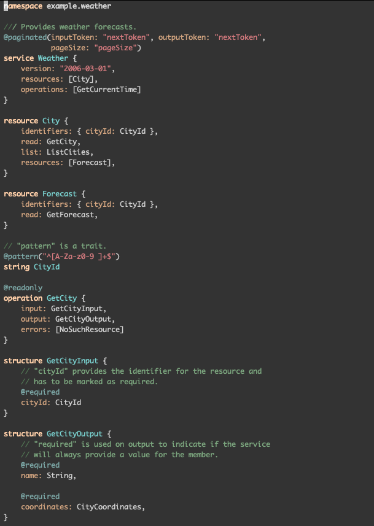

What is this
============

This is a quick implementation of a
`smithy <https://awslabs.github.io/smithy/quickstart.html>`__ major mode for
emacs.

Weather example rendered with zenburn:

How to install
==============

Download the ``smithy-mode.el`` file and place it somewhere on your emacs load path.
In your ``.emacs`` file require smithy-mode and ``.smithy`` files should
automatically start smithy mode. In the following example the ``smithy-mode.el``
file was downloaded to ``~/.emacs.d/custom-modes/``.

.. code-block:: elisp

  (add-to-list 'load-path "~/.emacs.d/custom-modes")
  (require 'smithy-mode)

Links
=====

`Smithy home page <https://awslabs.github.io/smithy/>`__
